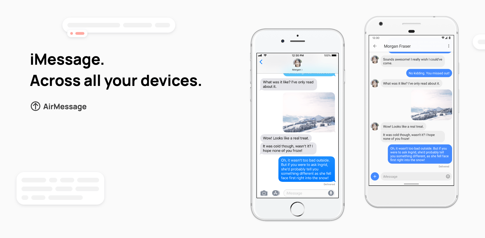

# AirMessage for Android

AirMessage lets people use iMessage on the devices they like. **AirMessage for Android** is the project's client for Android devices, with an emphasis on feeling like a part of the Android ecosystem. AirMessage for Android can be downloaded from the [Google Play Store](https://play.google.com/store/apps/details?id=me.tagavari.airmessage).

## Getting started

AirMessage for Android uses [RxJava](https://github.com/ReactiveX/RxJava) to manage its internal logic. If you're not familiar with RxJava, the repository's README file is a great place to get started:

[https://github.com/ReactiveX/RxJava](https://github.com/ReactiveX/RxJava#readme)

AirMessage for Android hooks in to Google Cloud and Firebase to utilize services like FCM, Google Maps, and Crashlytics. The app will not build without a valid configuration, so to get started quickly, you can copy the `app/google-services.default.json` file to `app/google-services.json` to use a pre-configured Firebase project, or you may hook into your own Firebase project. Similarly, the app will use the API key found in `secrets.default.properties` for Google Maps by default, and you can supply your own in `secrets.properties`.

---

Thank you for your interest in contributing to AirMessage!
You're helping to shape the future of an open, secure messaging market.
Should you have any questions, comments, or concerns, please shoot an email to [hello@airmessage.org](mailto:hello@airmessage.org).